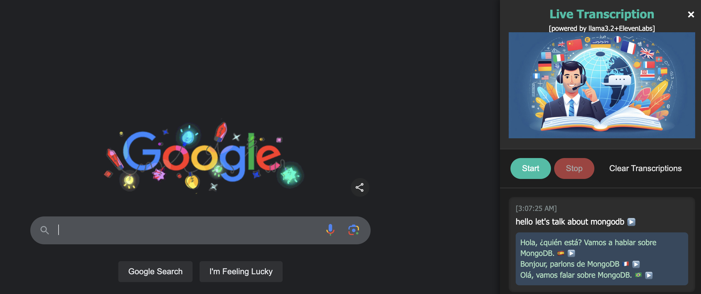

# woah-llama



web browser extension using ollama

---

# Building a Live Transcription Sidebar Browser Extension with Translation and Text-to-Speech

In today's fast-paced digital landscape, having tools that enhance productivity and accessibility is more important than ever. Imagine a browser extension that listens to your audio, transcribes it in real-time, translates the transcription into multiple languages, and even reads it back to you using natural-sounding voices. This blog post will guide you through building such a powerful extension using modern web technologies and AI services like Eleven Labs and Llama 3.2.

This project involves creating a Chrome browser extension that provides a live transcription sidebar. The extension listens to audio from the active tab, transcribes it in real-time, translates the transcription into multiple languages, and offers text-to-speech functionality for both the original and translated text. The integration of services like Eleven Labs for text-to-speech and Llama 3.2 via Ollama for translations ensures high-quality outputs.

## Key Features

- **Live Audio Transcription:** Converts spoken words into text in real-time.
- **Multi-language Translation:** Translates transcribed text into languages like Spanish, French, and Portuguese.
- **Text-to-Speech:** Reads out the original and translated texts using natural-sounding voices.
- **User-friendly Sidebar:** Provides controls to start/stop transcription, clear transcriptions, and manage settings.
- **Persistent Storage:** Saves transcriptions locally, ensuring they persist across sessions.

## Technical Stack

- **Frontend:**
  - **JavaScript:** Core logic for the extension's functionality.
  - **HTML & CSS:** Structure and styling of the sidebar.
  - **Chrome Extension APIs:** For permissions, storage, and scripting.
  
- **Backend:**
  - **Python (Flask):** Serves as an intermediary between the extension and the Llama 3.2 model.
  - **Ollama:** Hosts the Llama 3.2 model for translations.
  
- **APIs:**
  - **Eleven Labs:** For text-to-speech functionality.
  - **OpenAI:** For language model interactions via Ollama.

## Setting Up the Project

Let's dive into the components of the extension and understand how they work together.

### 1. Manifest Configuration

The `manifest.json` file defines the extension's metadata, permissions, and the resources it uses.

```json
{
  "manifest_version": 3,
  "name": "Live Transcription Sidebar",
  "version": "1.1",
  "description": "An extension that listens to audio and transcribes it.",
  "permissions": ["scripting", "activeTab", "storage"],
  "host_permissions": ["http://localhost:5000/*","https://api.elevenlabs.io/*"],
  "content_scripts": [
    {
      "matches": ["<all_urls>"],
      "js": ["contentScript.js"],
      "css": ["sidebar.css"]
    }
  ],
  "icons": {
    "16": "icon.png",
    "48": "icon.png",
    "128": "icon.png"
  }
}
```

**Key Points:**

- **Permissions:**
  - `scripting` and `activeTab` are essential for injecting scripts and interacting with the active tab's content.
  - `storage` allows the extension to save and retrieve transcription data.
  - `host_permissions` specify the external APIs the extension will interact with, such as the backend server and Eleven Labs API.
  
- **Content Scripts:**
  - `contentScript.js` handles the core functionality of transcription, translation, and text-to-speech.
  - `sidebar.css` styles the transcription sidebar.

### 2. Sidebar Styling

The `sidebar.css` file ensures the transcription sidebar is visually appealing and user-friendly.

```css
/* sidebar.css */

/* General Sidebar Styling */
#transcription-sidebar {
    position: fixed;
    top: 0;
    right: 0;
    width: 350px;
    height: 100%;
    background-color: #1e1e1e;
    box-shadow: -2px 0 12px rgba(0, 0, 0, 0.5);
    z-index: 100000; /* Ensures the sidebar is above all other elements */
    display: flex;
    flex-direction: column;
    font-family: 'Segoe UI', Tahoma, Geneva, Verdana, sans-serif;
    color: #ffffff;
    transition: transform 0.3s ease-in-out;
  }
  
  /* Header Styling */
  #transcription-sidebar header {
    background-color: #2d2d2d;
    padding: 15px;
    text-align: center;
    border-bottom: 1px solid #3c3c3c;
    position: relative;
  }
  
  #transcription-sidebar header h2 {
    margin: 0;
    font-size: 20px;
    font-weight: 600;
    color: #00bfa5;
  }
  
  /* Close Button Styling */
  #transcription-sidebar .close-btn {
    position: absolute;
    top: 15px;
    right: 15px;
    background: none;
    border: none;
    color: #ffffff;
    font-size: 24px;
    cursor: pointer;
    transition: color 0.2s ease;
  }
  
  #transcription-sidebar .close-btn:hover {
    color: #ff5252;
  }
  
  /* Controls Section */
  #transcription-sidebar #controls {
    padding: 15px;
    display: flex;
    justify-content: space-around;
    border-bottom: 1px solid #3c3c3c;
  }
  
  #transcription-sidebar #controls button {
    padding: 10px 20px;
    font-size: 14px;
    font-weight: 500;
    border: none;
    border-radius: 25px;
    cursor: pointer;
    transition: background-color 0.2s ease, transform 0.2s ease;
  }
  
  #transcription-sidebar #controls button:disabled {
    opacity: 0.6;
    cursor: not-allowed;
  }
  
  /* Start Button */
  #start-btn {
    background-color: #00bfa5;
    color: #ffffff;
  }
  
  #start-btn:hover:not(:disabled) {
    background-color: #00c4aa;
    transform: scale(1.05);
  }
  
  /* Stop Button */
  #stop-btn {
    background-color: #ff5252;
    color: #ffffff;
  }
  
  #stop-btn:hover:not(:disabled) {
    background-color: #ff6b6b;
    transform: scale(1.05);
  }
  
  /* Transcriptions Display */
  #transcription-sidebar #transcriptions {
    flex: 1;
    padding: 15px;
    overflow-y: auto;
    background-color: #1e1e1e;
  }
  
  /* Transcription Item */
  .transcription-item {
    background-color: #2d2d2d;
    margin-bottom: 10px;
    padding: 12px;
    border-radius: 8px;
    box-shadow: inset 0 0 5px rgba(0, 0, 0, 0.3);
    transition: background-color 0.2s ease;
  }
  
  .transcription-item:hover {
    background-color: #3c3c3c;
  }
  
  /* Timestamp Styling */
  .transcription-item span.timestamp {
    display: block;
    font-size: 12px;
    color: #7f8c8d;
    margin-bottom: 5px;
  }
  
  /* Original Text Styling */
  .transcription-item p.text {
    margin: 0;
    font-size: 14px;
    line-height: 1.5;
  }
  
  /* Processed Response Styling */
  .transcription-item p.response {
    margin: 8px 0 0 0;
    font-size: 13px;
    line-height: 1.4;
    color: #a9dfbf;
    background-color: #34495e;
    padding: 8px;
    border-radius: 6px;
  }
  
  /* Scrollbar Styling */
  #transcription-sidebar #transcriptions::-webkit-scrollbar {
    width: 8px;
  }
  
  #transcription-sidebar #transcriptions::-webkit-scrollbar-track {
    background: #2d2d2d;
  }
  
  #transcription-sidebar #transcriptions::-webkit-scrollbar-thumb {
    background-color: #555;
    border-radius: 4px;
  }
  
  /* Responsive Design */
  @media (max-width: 400px) {
    #transcription-sidebar {
      width: 100%;
    }
  }
  
  /* loading-gif style for chat */
  .loading-gif {
    width: 20px;
    height: 20px;
    animation: spin 1s linear infinite;
  }
  
  @keyframes spin {
    0% { transform: rotate(0deg); }
    100% { transform: rotate(360deg); }
  }
```

**Highlights:**

- **Responsive Design:** The sidebar adapts to different screen sizes, ensuring usability on various devices.
- **Aesthetic Appeal:** Dark theme with contrasting colors enhances readability and reduces eye strain.
- **Interactive Elements:** Buttons have hover effects and transitions for better user interaction.
- **Scrollbar Customization:** Provides a seamless and integrated look with the sidebar's design.

### 3. Content Script

The `contentScript.js` is the heart of the extension, handling transcription, translation, and text-to-speech functionalities.

```javascript
// contentScript.js

// ======== Configuration ========
// IMPORTANT: Storing API keys directly in client-side scripts is insecure.
// Consider moving API interactions to a secure backend server.
const ELEVEN_LABS_API_KEY = '';
let ELEVEN_LABS_VOICE_ID = 'fnoOtHjtLbYs6mOpUSdr'; // e.g., '21m00Tcm4TlvDq8ikWAM'

// ======== Generate Speech Function ========
async function generateSpeech(text, voiceId, apiKey) {
  try {
    const response = await fetch(`https://api.elevenlabs.io/v1/text-to-speech/${voiceId}`, {
      method: 'POST',
      headers: {
        'Accept': 'audio/mpeg',
        'Content-Type': 'application/json',
        'xi-api-key': apiKey
      },
      body: JSON.stringify({
        text: text,
        model_id: 'eleven_multilingual_v2',
        voice_settings: {
          stability: 0.5,
          similarity_boost: 0.5
        }
      })
    });

    if (response.ok) {
      const blob = await response.blob();
      return URL.createObjectURL(blob);
    } else {
      const errorData = await response.json();
      throw new Error(`Failed to generate speech: ${errorData.error || response.statusText}`);
    }
  } catch (error) {
    console.error('Error in generateSpeech:', error);
    throw error;
  }
}

// ======== Create Sidebar HTML with Close Button ========
const sidebarHTML = `
  <div id="transcription-sidebar">
    <header>
      <h2>Live Transcription</h2>
      <sub>[powered by llama3.2+ElevenLabs]</sub>
      
      <button class="close-btn" title="Close Sidebar">&times;</button>
    </header>
    <div id="controls">
      <button id="start-btn">Start</button>
      <button id="stop-btn" disabled>Stop</button>
      <button id="clear-btn">Clear Transcriptions</button>
    </div>
    <div id="transcriptions"></div>
  </div>
`;

// ======== Inject Sidebar into the Page ========
const sidebarContainer = document.createElement('div');
sidebarContainer.innerHTML = sidebarHTML;
document.body.appendChild(sidebarContainer);

// ======== Access Elements ========
const startBtn = document.getElementById('start-btn');
const stopBtn = document.getElementById('stop-btn');
const clearBtn = document.getElementById('clear-btn');
const transcriptionsDiv = document.getElementById('transcriptions');
const closeBtn = document.querySelector('.close-btn');

// ======== Initialize Variables ========
let recognition;
let isRecognizing = false;
let transcriptions = [];

// ======== Add Minimal Styles for Speak Buttons ========
const buttonStyle = document.createElement('style');
buttonStyle.textContent = `
  /* Speak Button Styles */
  .speak-btn {
    background: none;
    border: none;
    cursor: pointer;
    margin-left: 5px;
    font-size: 1em;
    vertical-align: middle;
  }

  .speak-btn:hover {
    color: #4CAF50; /* Optional: Change color on hover */
  }

  /* Optional: Style for the Speak Button Icon */
  .speak-btn::before {
    content: '▶️';
    display: inline-block;
    margin-right: 3px;
  }
`;
document.head.appendChild(buttonStyle);

// ======== Clear Transcriptions ========
function clearTranscriptions() {
  transcriptions = [];
  chrome.storage.local.set({ transcriptions }, () => {
    if (chrome.runtime.lastError) {
      console.error('Error clearing transcriptions:', chrome.runtime.lastError);
    }
  });
  renderTranscriptions();
}

// ======== Load Transcriptions from Storage ========
chrome.storage.local.get(['transcriptions'], (result) => {
  transcriptions = result.transcriptions || [];
  renderTranscriptions();
});

// ======== Event Listener for Clear Button ========
clearBtn.addEventListener('click', clearTranscriptions);

// ======== Initialize Speech Recognition ========
function initRecognition() {
  const SpeechRecognition = window.SpeechRecognition || window.webkitSpeechRecognition;
  if (!SpeechRecognition) {
    alert("Sorry, your browser does not support Speech Recognition.");
    return;
  }

  recognition = new SpeechRecognition();
  recognition.continuous = true;
  recognition.interimResults = false;
  recognition.lang = 'en-US';

  recognition.onresult = (event) => {
    for (let i = event.resultIndex; i < event.results.length; ++i) {
      if (event.results[i].isFinal) {
        const transcript = event.results[i][0].transcript.trim();
        addTranscription(transcript);
      }
    }
  };

  recognition.onerror = (event) => {
    console.error('Speech recognition error:', event.error);
    alert(`Speech recognition error: ${event.error}`);
  };

  recognition.onend = () => {
    if (isRecognizing) {
      recognition.start(); // Restart recognition if it ended unexpectedly
    }
  };
}

// ======== Start Recognition ========
function startRecognition() {
  if (isRecognizing) return;
  isRecognizing = true;
  initRecognition();
  if (recognition) {
    recognition.start();
    startBtn.disabled = true;
    stopBtn.disabled = false;
  }
}

// ======== Stop Recognition ========
function stopRecognition() {
  if (!isRecognizing) return;
  isRecognizing = false;
  if (recognition) {
    recognition.stop();
    startBtn.disabled = false;
    stopBtn.disabled = true;
  }
}

// ======== Add Transcription and Send to Endpoint ========
function addTranscription(text) {
  const transcription = {
    text: text,
    timestamp: new Date().toLocaleTimeString(),
    processed: false, // Flag to prevent re-processing on reload
    response: null
  };
  transcriptions.push(transcription);
  const index = transcriptions.length - 1;
  saveTranscriptions();
  renderTranscription(transcription, index);
  sendToEndpoint(transcription, index);
}

// ======== Save Transcriptions to Storage ========
function saveTranscriptions() {
  chrome.storage.local.set({ transcriptions }, () => {
    if (chrome.runtime.lastError) {
      console.error('Error saving transcriptions:', chrome.runtime.lastError);
    }
  });
}

// ======== Load and Render Transcriptions ========
function renderTranscriptions() {
  transcriptionsDiv.innerHTML = '';
  transcriptions.forEach((transcription, index) => {
    renderTranscription(transcription, index);
    if (!transcription.processed) {
      sendToEndpoint(transcription, index);
    }
  });
}

// ======== Render a Single Transcription ========
function renderTranscription(transcription, index) {
  let div = document.getElementById('transcription-' + index);

  if (!div) {
    // If the div doesn't exist, create it
    div = document.createElement('div');
    div.className = 'transcription-item';
    div.id = 'transcription-' + index;

    const timestampSpan = document.createElement('span');
    timestampSpan.className = 'timestamp';
    timestampSpan.textContent = `[${transcription.timestamp}]`;
    div.appendChild(timestampSpan);

    const textPara = document.createElement('p');
    textPara.className = 'text';
    textPara.textContent = transcription.text;
    div.appendChild(textPara);

    // Add Speak Button for Original Text
    const speakButton = document.createElement('button');
    speakButton.className = 'speak-btn';
    speakButton.title = 'Speak';
    speakButton.addEventListener('click', () => handleSpeak(transcription.text, speakButton));
    textPara.appendChild(speakButton);

    transcriptionsDiv.appendChild(div);
  }

  // Handle the response (translations)
  if (transcription.response) {
    let responsePara = div.querySelector('p.response');
    if (!responsePara) {
      responsePara = document.createElement('p');
      responsePara.className = 'response';
      div.appendChild(responsePara);
    }
    responsePara.innerHTML = ''; // Clear existing content

    const responseTexts = transcription.response.split('<br />');
    responseTexts.forEach((respText) => {
      const respSpan = document.createElement('span');
      respSpan.textContent = respText;
      responsePara.appendChild(respSpan);

      // Add Speak Button for Each Translation
      const speakBtn = document.createElement('button');
      speakBtn.className = 'speak-btn';
      speakBtn.title = 'Speak';
      speakBtn.addEventListener('click', () => handleSpeak(stripHTML(respText), speakBtn));
      responsePara.appendChild(speakBtn);

      responsePara.appendChild(document.createElement('br'));
    });
  }

  // Scroll to the bottom to show the latest transcription
  transcriptionsDiv.scrollTop = transcriptionsDiv.scrollHeight;
}

// ======== Helper Function to Strip HTML Tags ========
function stripHTML(html) {
  var tmp = document.createElement("DIV");
  tmp.innerHTML = html;
  return tmp.textContent || tmp.innerText || "";
}

// ======== Handle Speak Button Click ========
async function handleSpeak(text, button) {
  try {
    // Optionally disable the button to prevent multiple clicks
    button.disabled = true;

    // Generate Speech Audio URL
    const audioUrl = await generateSpeech(text, ELEVEN_LABS_VOICE_ID, ELEVEN_LABS_API_KEY);

    // Create and Play Audio
    const audio = new Audio(audioUrl);
    audio.play();

    // Re-enable the button after playback
    audio.onended = () => {
      URL.revokeObjectURL(audioUrl);
      button.disabled = false;
    };

    // Handle audio playback errors
    audio.onerror = () => {
      console.error('Error playing audio.');
      alert('Failed to play audio.');
      button.disabled = false;
    };
  } catch (error) {
    console.error('Error in handleSpeak:', error);
    alert('Failed to generate speech. Please try again.');
    button.disabled = false;
  }
}

// ======== Send Transcription to the Endpoint ========
function sendToEndpoint(transcription, index) {
  const languages = ['Spanish', 'French', 'Portuguese'];
  const fetchPromises = languages.map((lang) => {
    const promptText = `Translate this text into ${lang}: ${transcription.text}. Include flag emoji representing language. Respond with plaintext+emoji.`;
    const encodedText = encodeURIComponent(promptText);
    const endpoint = `http://localhost:5000/q?prompt=${encodedText}`;

    return fetch(endpoint)
      .then(response => response.json())
      .then(data => {
        // Assuming the endpoint returns JSON with a 'response' field
        return data.response || 'No result returned';
      })
      .catch(error => {
        console.error('Error sending transcription to endpoint:', error);
        // Return an error message to include it in the processedText
        return `Error processing text for ${lang}`;
      });
  });

  // Wait for all fetch promises to resolve
  Promise.all(fetchPromises)
    .then(results => {
      const processedText = results.join('<br />');
      transcriptions[index].processed = true;
      transcriptions[index].response = processedText;
      saveTranscriptions();
      renderTranscription(transcriptions[index], index);
    })
    .catch(error => {
      console.error('Error processing all translations:', error);
      transcriptions[index].processed = true;
      transcriptions[index].response = 'Error processing translations';
      saveTranscriptions();
      renderTranscription(transcriptions[index], index);
    });
}

// ======== Event Listener for Close Button ========
closeBtn.addEventListener('click', () => {
  sidebarContainer.style.transform = 'translateX(100%)';
  setTimeout(() => {
    sidebarContainer.remove();
  }, 300); // Match the CSS transition duration if any
});

// ======== Event Listeners for Start and Stop Buttons ========
startBtn.addEventListener('click', startRecognition);
stopBtn.addEventListener('click', stopRecognition);
```

**Functionality Breakdown:**

1. **Configuration:**
   - **API Keys:** The Eleven Labs API key is crucial for text-to-speech. **Security Note:** Storing API keys in client-side scripts is insecure. It's recommended to handle API interactions through a secure backend server to protect sensitive information.

2. **Generating Speech:**
   - The `generateSpeech` function interacts with the Eleven Labs API to convert text into speech, returning a URL for the generated audio.

3. **Sidebar Creation:**
   - Injects a styled sidebar into the webpage, providing controls to start/stop transcription and clear transcriptions.

4. **Speech Recognition:**
   - Utilizes the Web Speech API to transcribe live audio. It listens continuously and handles results, errors, and unexpected terminations by restarting recognition if necessary.

5. **Transcription Management:**
   - **Adding Transcriptions:** Each transcription is timestamped, saved, and rendered in the sidebar.
   - **Persistent Storage:** Uses Chrome's `storage.local` to save transcriptions, ensuring they persist across browser sessions.
   
6. **Translation Integration:**
   - Sends transcribed text to a backend server for translation into specified languages (Spanish, French, Portuguese) using Llama 3.2 via Ollama.
   - Displays translated text with corresponding flag emojis for visual cues.

7. **Text-to-Speech:**
   - Provides buttons to listen to both original and translated texts, enhancing accessibility and user experience.

8. **User Controls:**
   - Start, Stop, and Clear buttons allow users to manage the transcription process seamlessly.
   - A close button enables users to hide the sidebar when not needed.

### 4. Backend Server

The `server.py` script sets up a Flask server that interfaces with the Llama 3.2 model via Ollama to handle translation requests.

```python
# server.py
from openai import OpenAI
from typing import Optional, List, Dict, Any
# from openai import AzureOpenAI

class UnifiedLLM:
    def __init__(
        self,
        service: str = "ollama",
        api_key: Optional[str] = None,
        base_url: Optional[str] = None,
        temperature: float = 0.0,
        max_tokens: int = 100,
        model: str = "llama3.2",
    ):
        self.service = service.lower()
        self.model = model
        self.temperature = temperature
        self.max_tokens = max_tokens
        self.api_key = api_key
        self.base_url = base_url
        
        if self.service == "ollama":
            self.client = OpenAI(
                base_url="http://localhost:11434/v1",
                api_key="ollama" # dummy key
            )
        elif self.service == "azure":
            self.client = AzureOpenAI(
                api_key=self.api_key,
                api_version="2024-10-21",
                azure_endpoint=self.base_url
            )
        else:  # Default to OpenAI
            self.client = OpenAI(api_key=api_key, base_url=base_url)

    def chat_completion(self, messages: List[Dict[str, str]]) -> str:
        try:
            response = self.client.chat.completions.create(
                model=self.model,
                messages=messages,
                temperature=self.temperature,
                max_tokens=self.max_tokens
            )
            return response.choices[0].message.content
        except Exception as e:
            return f"Error: {str(e)}"

    def __call__(self, prompt: str) -> str:
        messages = [
            {"role": "system", "content": "Perform the translation task. Only respond with translated text.DO NOT MAKE UP ANY PART OF YOUR RESPONSE. ONLY RESPOND WITH TRANSLATED TEXT."},
            {"role": "user", "content": prompt}
        ]
        return self.chat_completion(messages)
   

from flask import Flask, request, jsonify
from flask_cors import CORS

app = Flask(__name__)
CORS(app)  # This will enable CORS for all routes

ollama_llm = UnifiedLLM()

@app.route('/q', methods=['GET', 'POST'])
def explain():
    if request.method == 'POST':
        data = request.get_json()
        prompt = data.get('prompt')
    elif request.method == 'GET':
        prompt = request.args.get('prompt')
    else:
        return jsonify({'error': 'Invalid method'}), 405

    response = ollama_llm(prompt)
    return jsonify({'response': response})

if __name__ == '__main__':
    app.run(debug=True)
```

**Key Components:**

1. **UnifiedLLM Class:**
   - **Purpose:** Abstracts the interaction with different language model services (Ollama, Azure, OpenAI).
   - **Initialization:** Sets up the client based on the chosen service. Defaults to Ollama for local execution.
   - **Chat Completion:** Sends messages to the model and retrieves the response.
   - **Callable:** Allows the class instance to be called with a prompt, streamlining the translation process.

2. **Flask Server:**
   - **CORS Enabled:** Ensures that the frontend can communicate with the backend without cross-origin issues.
   - **Endpoint `/q`:** Accepts GET and POST requests with a `prompt` parameter, processes the translation, and returns the response.

**Running the Server:**

Ensure that you have Flask and other dependencies installed. Run the server using:

```bash
python server.py
```

**Note:** The server assumes that Ollama is running locally on port `11434`. Ensure Ollama and the Llama 3.2 model are correctly set up and running.

## Security Considerations

While the extension offers powerful functionalities, security is paramount, especially when handling API keys and sensitive data.

1. **API Key Management:**
   - **Avoid Client-Side Storage:** Storing API keys in client-side scripts exposes them to potential misuse. Instead, handle API interactions through a secure backend server.
   - **Environment Variables:** Use environment variables or secure storage solutions on the backend to manage API keys.

2. **CORS Configuration:**
   - Ensure that the backend server only accepts requests from trusted origins to prevent unauthorized access.

3. **Data Privacy:**
   - Be mindful of the data being transcribed and translated. Ensure compliance with data protection regulations like GDPR.

4. **Error Handling:**
   - Implement robust error handling to prevent leaking sensitive information through error messages.

## Integrating Translation with Ollama and Llama 3.2

The integration of Ollama with the Llama 3.2 model provides efficient and privacy-focused translations. Here's how it enhances the project:

1. **Local Execution:**
   - Running the model locally ensures that data doesn't leave the user's machine, enhancing privacy.

2. **Customization:**
   - Ollama allows for custom prompts and system messages, enabling tailored translations and responses.

3. **Performance:**
   - While local execution reduces cloud dependencies, it's essential to balance model size with available hardware resources to maintain performance.

**Usage Example:**

When a transcription is added, it's sent to the `/q` endpoint with a prompt like:

```
Translate this text into Spanish: [Transcribed Text]. Include flag emoji representing language. Respond with plaintext+emoji.
```

The server processes this prompt using Llama 3.2 via Ollama and returns the translated text with appropriate emojis.

## Conclusion

Building a live transcription sidebar browser extension with translation and text-to-speech capabilities is a multifaceted project that leverages modern web technologies and AI services. By integrating tools like the Web Speech API, Eleven Labs, and Llama 3.2 via Ollama, developers can create powerful applications that enhance productivity, accessibility, and user experience.
